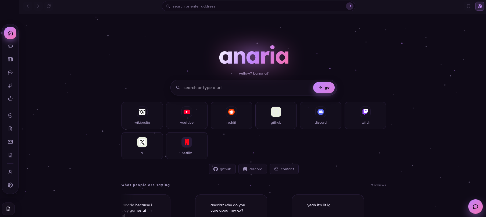

<h1 align="center">anaria!</h1>




<p align="center">
  anaria is a ubg proxy made for students and also is very easy to use. we have over 2,000 games from multiple sources including cloud gaming, a fast browsing expreience, customization options, and much more. each update brings fixes and keeps improiving the site
</p>

## features
- cloud gaming
- regular gaming
- webported games
- movies
- music
- chatroom
- panic key
- cloaking

## self hosting

anaria! is perfect to self-host or deploy to any services like railway, render, etc. anaria! recommends using railway, it was what v2 was using and what some of v3 used to run on. Now we use a dedicated server, but for small self hosting for a couple hours a personal machine is fine.

## local deploying

> [!IMPORTANT]
> anaria! repo started out as private so online deploying won't be available for only some time, please bear with us.

```sh
#cloning
git clone https://github.com/yaans-coat/anaria

#directory
cd anaria

#node scripts
npm install
node server.js
```

## credits

[bog from truffled](https://truffled.lol) - gave me the help i needed
[x8rr from cherri](https://cherrion.top) - made some apis and tools that i use.
[selenite.cc](https://selenite.cc) - some of the ui inspiration
[lyra](https://lyra.zip) - the overall inspiration of anaria


## if you fork this repo

please consider starring the repo!

---

you must not
- modify the [license](LICENSE)
- claim this code is yours unless you actually do something to change it in drastic ways
- use the raw code without credit (means removing the code that displays the contact, dmca, github repo, etc.)
- steal the code

---

you may
- deploy with no modifications
- deploy with modifications (change-log required and states this is not the official version)
- do actions that are defined by the license

to abide all stated rules, add a disclaimer like this:

---

## fork info

this repo was forked from [yaans-coat/anaria](https://github.com/yaans-coat/anaria). all code was made by the project owner (yaans-coat). the following changes have been made to this fork:

* Change 1
* Change 2
* Change 3

---
